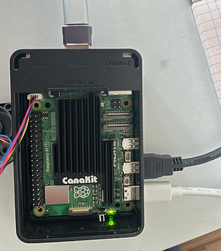

# oh-my-db
Oh My Database - the shockingly amazing replicated database powered by RAFT and built by Hayden, Tommy, and Aditya!

## Build Instructions
```shell
mkdir build
cd build
cmake ../ -DCMAKE_INSTALL_PREFIX=.
cmake --build . --parallel 16
```

## First run!
- The key configuration file is `config.csv`, a sample is included in this repo (see `sample_config.csv`). If you are running on cloudlab, you can use our utilities to generate a config from the cloudlab manifest. Otherwise, it is always okay to simply edit it by hand. It is fairly intuitive.
- Note that this repo needs to be cloned and built on each of the replica nodes.
- Launch `replica` binary on each of the replicas. Note that this binary is available in `build/ohmyserver/` upon building.
- The command line will look like as follows:
```
./replica --config ../../config.csv --db_path /tmp/db_0 --id 0
```
- Note that there is an `id` parameter which tells which node configuration (out of the several available in `config.csv` to use). Clearly each replica needs to be launched with a distinct id.
- Once the majority of the replicas are up, the cluster is ready. You will observe logs showing election happening and one of the replica's status changing to leader.
- For a quick test, run the following benchmarking tool (also available under `build/ohmyserver/`). This should print latencies for reads, writes, etc.
```
./client --config ../../config.csv --iter 3
```
- You are now ready to do more with this cluster!

## Where? What?
- `ohmyserver`: Contains all the RPC clients, services (`RaftService` and `DatabaseService`), and tools (like `updatemask`) that use RPCs in some form.
- `ohmyraft`: Contains RAFT implementation and related concurrency related utilities.
- `ohmytools`: Log persistence related tools - to read and write store for testing and debugging.
- `ohmydb`: Database backend and `ReplicatedDB` library for users to use.
- `scripts`: Want to deploy the setup on a cluster? Look through our scripts!
- `prototype`: Initial RAFT prototype written in GoLang.
- `tests`: Some correctness tests

## I have OhMyDB cluster already setup, how do I use?
Look through `ohmydb/ReplicatedDB.H`. This is the class that handles everything for you. Here is an example:

```cpp
auto servers = ParseConfig( "/path/to/config.csv" );
auto repDB = ohmydb::ReplicatedDB( servers );

auto val = repDB.get( 45 );
if ( val.has_value() ) {
	std::cout << val.value() << std::endl;
} else {
	std::cerr << "key not found" << std::endl;
}

bool isSuccessful = repDB.put({45, 789});
```

## News!
__August 10, 2024:__ Recently we deployed this cluster on `Raspberry Pi 5` nodes. We are looking forward to supporting more constrainted nodes like `Raspberry Pi Zero`.



## Wow, how can I setup OhMyDB cluster?
The top level binary for each replica is called `replica` and the source resides in `ohmyserver/replica.cpp`. You can either handcraft a `config.csv` and launch the binary on each replica or use our scripts in `scripts`.

## Can I get a quick tour of some of the included tools?
Sure.
### `writestore` 
Generates a persistent store for a RAFT replica. This can be useful for testing and/or debugging.

It takes several command-line arguments, including the input file defining the log structure to generate, the output directory to dump all the output files in, the VotedFor value to generate store for, the CurrentTerm value to generate term for, and the ReplicaId for which the store is being generated.

```bash
./writestore --id 1 --outputdir /tmp/test/ --input ../../tests/correctness_1/rep2.csv --currentterm 3 --votedfor 2
```
Note that OhMyRaft requires the persistent store files to be named in a particular way. This tool takes care of that. For details on the naming scheme please look at the source. Furthermore, if `currentterm` and `votedfor` params are not provided they default to `0` and `-1` respectively.

The input file defining the log structure has the following structure (as an example):

```
count,term
1,2
2,3
3,1
```

This will yield the following log. Note that the actual operations are randomly picked as the only thing that matters to raft are the term numbers and indices. The numbers shown below are term numbers.
```
[1 1 2 2 2 3]
```

### `readstore`
Super useful tool for debugging! This allows reading the Raft log store and dumping the contents in a human readable format.

```zsh
➜  bin git:(main) ✗ ./readstore --file /tmp/test/raft.1.log.persist --vec   
INFO [readstore.cpp:37] Reading File=/tmp/test/raft.1.log.persist  IsPersistentVector=1
[0]     LogEntry=[Term=1 Op=Operation[ GET(49) HasPromise=0 ]]
[1]     LogEntry=[Term=1 Op=Operation[ GET(58) HasPromise=0 ]]
[2]     LogEntry=[Term=2 Op=Operation[ PUT(72, 44) HasPromise=0 ]]
[3]     LogEntry=[Term=2 Op=Operation[ PUT(23, 9) HasPromise=0 ]]
[4]     LogEntry=[Term=2 Op=Operation[ PUT(65, 92) HasPromise=0 ]]
[5]     LogEntry=[Term=2 Op=Operation[ PUT(87, 3) HasPromise=0 ]]
[6]     LogEntry=[Term=4 Op=Operation[ GET(29) HasPromise=0 ]]

➜  bin git:(main) ✗ ./readstore --file /tmp/test/raft.1.CurrentTerm.persist 
INFO [readstore.cpp:37] Reading File=/tmp/test/raft.1.CurrentTerm.persist  IsPersistentVector=0
Value: 81
```

Note that you need to pass `--vec` while trying to read logs. This is to tell the tool that the data format in the store is due to the `ohmyraft/PersistentVector` implementation.

### `updatemask`
Fun tool to create network partitions. The source file has inline documentation for more details. Here is an example:

```shell
./updatemask --config ../../config.csv  --partition "11100"
```
This puts replicas 0-2 in parition 1 and replicas 3,4 in parition 2. This is achieved by sending a `NetworkUpdate` RPC to the replicas which is a backdoor to `RaftRPCRouter` for Fault Injection. The router then discards RPC going out to replicas not in the same partition!


## I am impressed, where can I learn more?
Please check out our [presentation](https://docs.google.com/presentation/d/1LvWmjoi5s8yXWduE5RqvDNkIs7fRO2_zXMQeIn2xSLI/edit?usp=sharing).


